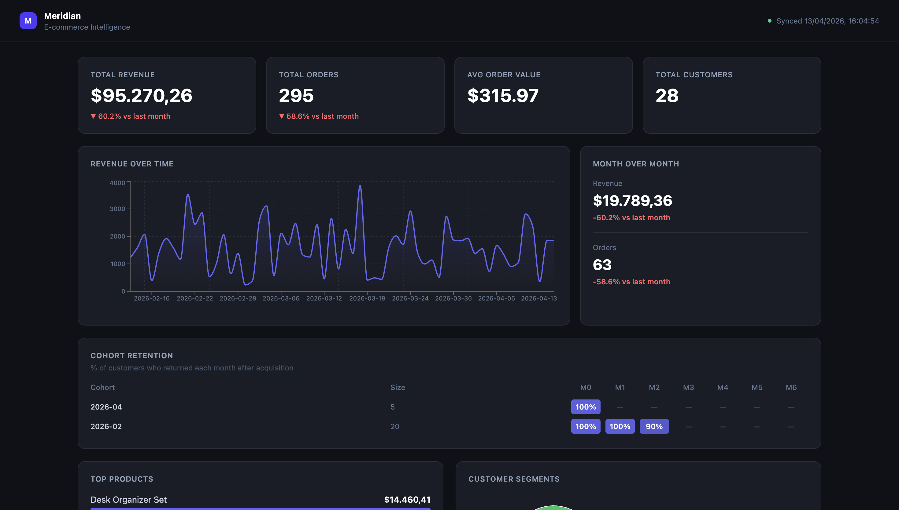
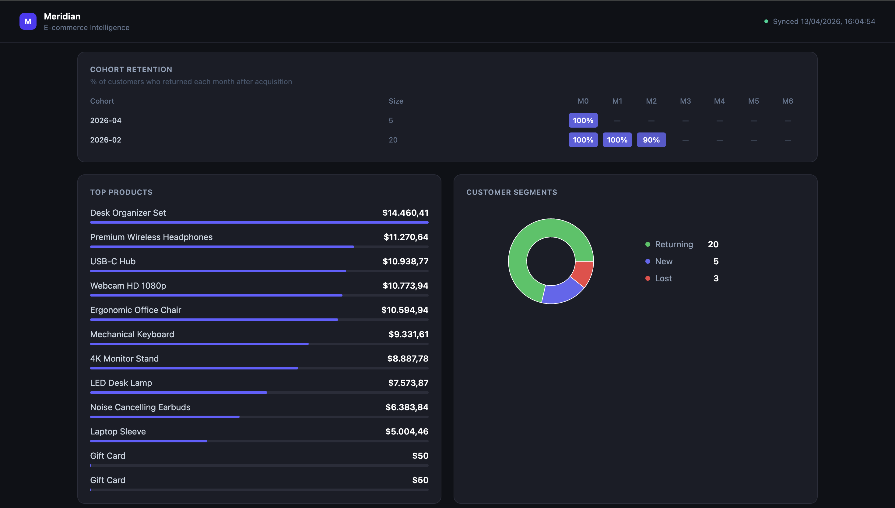

# Meridian — E-commerce Intelligence Platform

A full-stack analytics dashboard that connects to the Shopify API, syncs real store data, and computes business metrics — revenue trends, product performance, customer segmentation, and LTV.

Built as a portfolio project to demonstrate production-grade backend architecture with Django, async data pipelines with Celery, and a React dashboard with live data.





## Architecture

```
Shopify API (OAuth 2.0)
│
▼
┌─────────────────────────────┐
│     Raw Layer (Django)      │
│  ShopifyOrder               │
│  ShopifyProduct             │  ◄── Celery sync tasks
│  ShopifyCustomer            │      (incremental, cursor-based)
│  SyncJob                    │
└────────────┬────────────────┘
│
▼
┌─────────────────────────────┐
│   Analytics Layer (Django)  │
│  DailyRevenueSnapshot       │
│  ProductPerformance         │  ◄── Celery Beat (scheduled)
│  CustomerSegment            │
└────────────┬────────────────┘
│
▼
┌─────────────────────────────┐
│      DRF REST API           │
│  /api/metrics/overview/     │
│  /api/metrics/revenue/      │
│  /api/metrics/products/     │
│  /api/metrics/customers/    │
└────────────┬────────────────┘
│
▼
┌─────────────────────────────┐
│   React + Vite + Tailwind   │
│  KPI Cards                  │
│  Revenue Line Chart         │
│  Top Products Table         │
│  Customer Segments Pie      │
└─────────────────────────────┘
```

## Tech Stack

**Backend:** Django 4.2, Django REST Framework, PostgreSQL 15, Celery + Redis, Docker Compose

**Frontend:** React 18, Vite, Tailwind CSS, Recharts, Axios

**Integrations:** Shopify Admin REST API (OAuth 2.0, cursor-based pagination)

## Key Technical Highlights

- **Two-layer data architecture** — raw Shopify data separated from computed analytics (Bronze/Silver pattern)
- **Incremental sync** — cursor-based pagination via Shopify's `page_info`, never re-processes existing records
- **Pre-aggregated metrics** — revenue snapshots and product performance computed by Celery, not at query time
- **Customer segmentation** — rule-based LTV + recency scoring (New / Returning / At Risk / Lost)
- **SyncJob tracking** — every sync run is logged with status, record count, and error messages

## Getting Started

### Prerequisites

- Docker Desktop
- Shopify Partner account + development store

### Setup

```bash
git clone https://github.com/PlinioFDev/meridian.git
cd meridian
cp .env.example .env
# Fill in DJANGO_SECRET_KEY, SHOPIFY_API_KEY, SHOPIFY_API_SECRET in .env
docker compose up
```

**Step 1: Open Django Admin**
```
http://localhost:8080/admin/
```
Login with your superuser credentials.

**Step 2: Connect your Shopify store**
```
http://localhost:8080/shopify/install/?shop=your-store.myshopify.com
```

**Step 3: Trigger a sync**
```bash
docker compose exec backend python manage.py shell -c "
from apps.ingestion.tasks import sync_all
sync_all.delay(1)
"
```

**Step 4: Compute metrics**
```bash
docker compose exec backend python manage.py shell -c "
from apps.analytics.tasks import compute_metrics
compute_metrics(1)
"
```

**Step 5: Open the frontend**
```bash
cd frontend && npm install && npm run dev
```

Visit **http://localhost:5173**

## API Endpoints

| Endpoint | Description |
|----------|-------------|
| `GET /api/metrics/overview/` | KPIs: revenue, orders, AOV, customer counts |
| `GET /api/metrics/revenue/` | Daily revenue snapshots |
| `GET /api/metrics/products/` | Top products by revenue |
| `GET /api/metrics/customers/` | Customer segments + LTV |
| `GET /api/sync/status/` | Recent sync job history |

## Project Structure

```
meridian/
├── backend/
│   ├── apps/
│   │   ├── stores/        # ShopifyStore model + OAuth views
│   │   ├── ingestion/     # Raw models + Celery sync tasks + ShopifyClient
│   │   ├── analytics/     # Computed metrics models + engine + tasks
│   │   └── api/           # DRF serializers + views
│   └── meridian_project/  # Django settings, URLs, Celery config
├── frontend/
│   └── src/
│       ├── components/    # KPICard, RevenueChart, ProductsTable, CustomerSegments
│       └── api.js         # Axios API client
├── scripts/               # Seed script for test data
└── docker-compose.yml
```

## Roadmap

- [ ] Cohort retention matrix (SQL-based heatmap)
- [ ] WooCommerce integration
- [ ] Multi-store support
- [ ] Export to CSV
- [ ] Automated sync scheduling via Celery Beat
